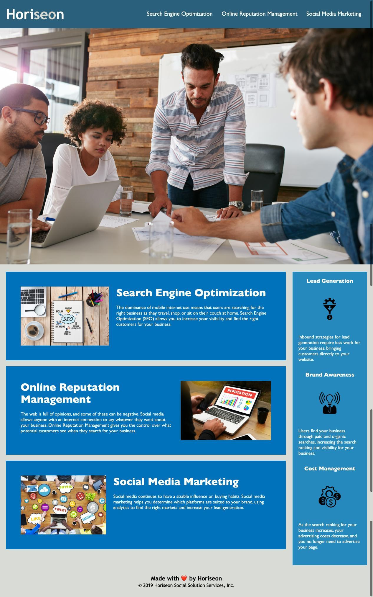

# Horiseon Code Refractor Assignment

## Introduction

Originally, when the Horiseon website was created, it didn't met the modern standards of acessibilities, according to the Americans with Disabilities Act. This lawrequires businesses to make accomodations for those with disabilities. In this exercise, we refractored the appliication code to meet the requirements of of the ADA without changing any part of the appearance of the website.

The HTML was redone to include semantic HTML elements, making sure we're following the correct structure of positions and styles. 

First, I changed the title of the site to be in line with the actual company name, including a semi-full description of what the site is and its purpose. Next, I replaced all of the div tags with semantic HTML elements throughout the structure of the code document to allow for a friendlier read view, and fixed some of the elements of the existing HTML as they were not functioning correctly. 

For the CSS, there wasn't as much as work done here but I condensed some of the tags together that were targeting similar selectors to allow for a cleaner view. Again, we didn't want to change the layout of the site, or really any part of how it looks, but the goal is to meet accessibility standards.

All changes to the code (HTML + CSS) are marked in commented out lines in each section of the HTML and CSS files. The application should run with no issues or errors and should render the same on all browsers. All files have been uploaded to a github repository (link is below) and the application has been deployed to a live url using github page (link for this is also below)

 

[github site] https://samohtebag.github.io/Horisen-Code-Refractor/

[github repo] https://github.com/samohtebag/Horisen-Code-Refractor
